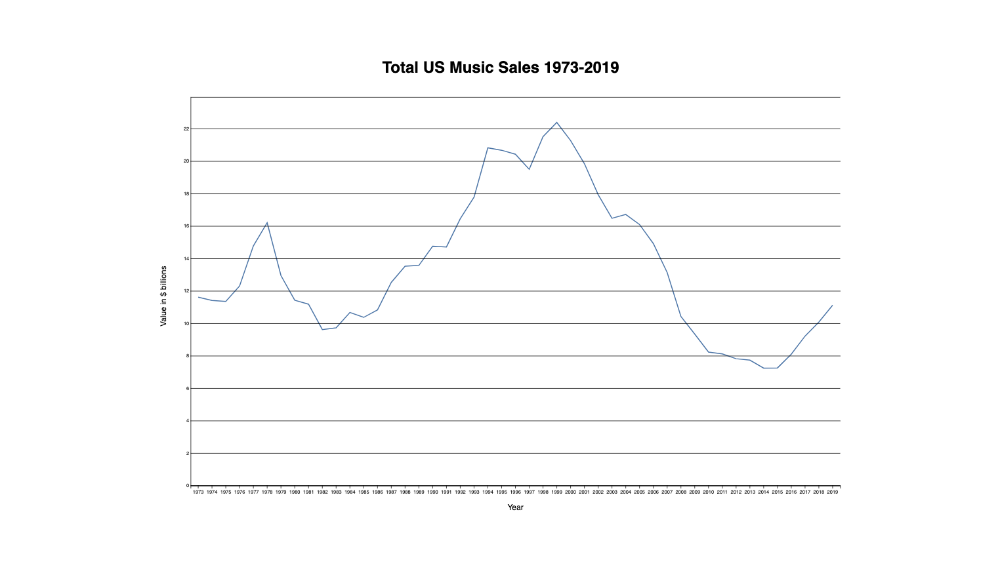
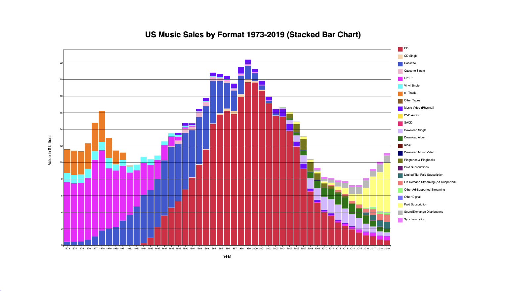

# US Music Sales Visualization: 1973-2019

This project showcases a data visualization that presents the total music sales in the United States from 1973 to 2019, along with a breakdown of music sales by format. The visualization provides valuable insights into the changes and trends in the music industry over the past few decades.

## Questions Answered by the Visualization

1. How have different music formats evolved over time, and did any experience a revitalization?
By examining the visual representation of music sales by format, the visualization demonstrates the rise and fall of various music formats. It highlights whether any formats experienced a resurgence or became more popular in recent years, shedding light on the ongoing evolution of music consumption patterns.

2. Which music formats have entirely disappeared?
The visualization enables identification of music formats that have become obsolete or disappeared from the market. By observing the absence of certain formats in the visualization, it becomes evident which formats are no longer relevant or commercially viable.

3. When did music sales experience a significant increase?
Analyzing the peaks and spikes in the visualization allows us to identify periods when music sales had substantial growth. By correlating these spikes with significant events or industry shifts, we can uncover potential factors that contributed to the surge in music sales during specific timeframes.

4. Has music become more or less profitable over time?
The visualization provides insights into the profitability of the music industry over the years. By examining the overall trend and patterns displayed in the visualization, it becomes possible to determine whether music sales have increased or decreased in profitability over time.

## Features

1. Utilizes interactive data visualization techniques.
2. Presents data in a visually engaging manner.
3. Includes clear visual cues for different music formats and total sales.
4. Implements data normalization techniques for accurate representation.

## How to Run

To explore the visualization, follow these steps:

1. Clone the repository to your local machine.
2. Open the project files in your preferred web browser.
3. Interact with the visualization to explore the changes in music sales and formats over time.
